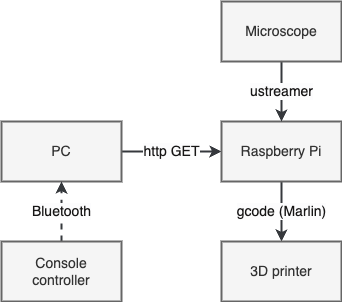

# conscopal

TL;DR _Use a console controller to move an optical microscope in three dimensions by having it mounted to a 3D printer stage._

[ ] TODO: Add a gif of it in action.

I wanted to create something engaging for my son's elementary school science/career fair. Now, the cliché is having children identify specimens in a microscope. However, with everyone's attention span being reduced to smithereens (we adults aren't any better) I felt like making something with a little more pizzazz.

I basically had everything in place but the controller. Our research group is fond of reconfiguring 3D printers for all sorts of things, from using the stage to raster scan batteries with acoustic sensors (see [sfogliatella](https://gogs.ceec.echem.io/clubsteingart/sfogliatella)), to blowing up batteries using the heating elements ([PMARC](https://github.com/dansteingart/pmarc)). The hardware is so cheap that [Marlin](https://marlinfw.org/) makes it a drop-in solution. Add Dan Steingart's (my PI) [nodeforwarder](https://github.com/dansteingart/nodeforwarder), which creates a RESTful interface for instruments connected over serial, and off you go.

Usually, we control the printer either manually _via_ a web interface (manually) or automatically through some programmatic abstraction. The framework for this project is inherited from Dan's [marlinscope](https://github.com/dansteingart/marlinscope), that is, using a modified 3D printer stage to move an optical microscope. Please check out that repo's `readme` to see a better articulated and thoughtful motivation for its utility. Therefore, this repo's only job is to listen in on the stream from the controller and relay it to the 3D printer.

<div align="center">
    
</div>

### Setup

1. Make sure your controller is connected to your computer over bluetooth.

2. Install dependencies
```
$ pip install -r requirements.txt
```

3.  Create a `.env` with the IP of the 3D printer endpoint, e.g. like this

```
$ touch .env && echo 'ENDPOINT = "YOUR_IP"' > .env
```

(or even `localhost` if everything is hosted on the same IP)

4. Start having fun

```
$ python main.py
```

5. Use the left joystick to navigate horizontally (X & Y axes), and up/down buttons to move commensurately up and down (Z axis).

6. Profit.


> **Caveats**: At the time of writing this has only been run on a Mac using [this](https://www.amazon.com/dp/B0BVSX1MW2?psc=1&ref=ppx_yo2ov_dt_b_product_details) store-brand "P4" (yes, not a typo) controller—the cheap controller didn't get recognized properly as a device on the RPi that controls the 3D printer stage & microscope.
